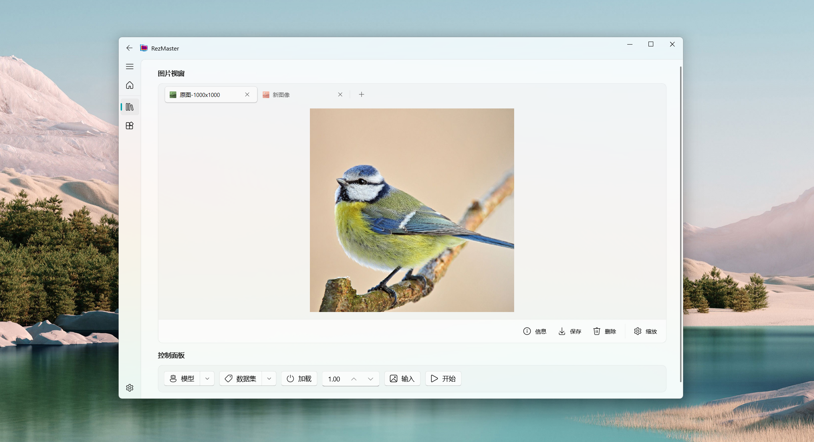

<p align="center">
  
</p>
  <h1 align="center">
  RezMaster
  </h1>
<p align="center">
  An awesome UI for visual model deployment based on PyQt5
</p>

<div align="center">


</div>

<details>
  <summary>Table of Contents</summary>
  <ol>
    <li><a href="#installation">Installation</a></li>
    <li><a href="#quickstart">Quickstart</a></li>
    <li><a href="#roadmap">Roadmap</a></li>
    <li><a href="#license">License</a></li>
    <li><a href="#acknowledgments">Acknowledgments</a></li>
  </ol>
</details>

# Installation
1. Create a conda environment.
   ```shell
   conda create -n qt python=3.9.18
   ```
2. Install the dependent packages.
   ```shell
   pip install -r requirements.txt
   ```
3. Download the model file and unzip it to the model folder.

> **Note**: To achieve faster model inference speed, it is necessary to properly configure the CUDA environment. For further development, some additional packages should be installed, such as `PyQt5-tools`. 

# Quickstart
1. Simply run the script.
   ```shell
   python main.py
   ```
2. Follow the on-screen instructions to operate.
   
   

# Roadmap

- [x] Release the main-feature available version v1.0.0

# License
RezMaster is released under [GPLv3](./LICENSE) license.

# Acknowledgments
- [PyQt-Fluent-Widgets](https://qfluentwidgets.com/)
- [PyQtImageViewer](https://github.com/marcel-goldschen-ohm/PyQtImageViewer)
